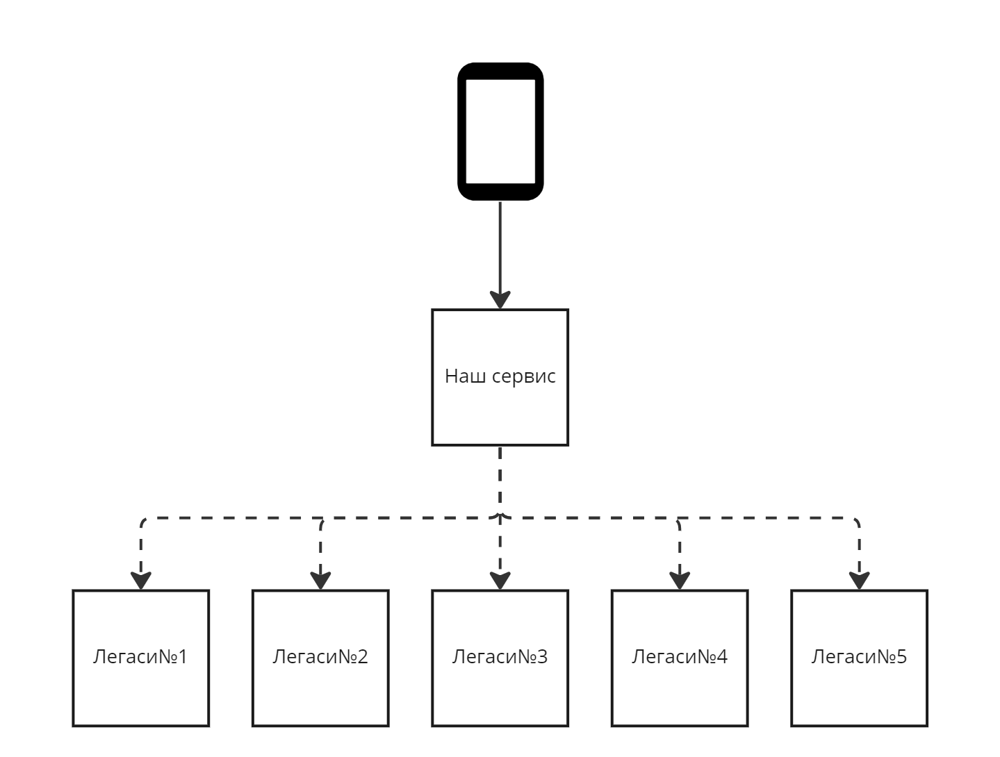

# Блеск и нищета синхронных запросов

## Кратко о себе

Всем привет, меня зовут Дмитрий Комаров. Когда то был Java - разработчиком в продуктовой команде, сейчас я тимлид
платформенной команды в МТС-Банке, делаем мобильное приложение

## Коротко о статье

Что будет:

- О RestTemplate
- Как его настроить
- Про Circuit Breaker
- История о том с какими проблемами мы столкнулись и как их решали

Чего не будет:

- Сравнение синхронного и ассинхроного взаимодействия
- Сравнение рест-клиентских реализаций
- Серебрянной пули от всех бед

## Интро

Одним октябрьским днем 2020 года я сидел и плевал в потолок после очередной закрытой тасочки.
Но пришел продакт со словами: "Дима, время делать фичи, делать крутые фичи".

### Крутая фича

_Детали что за фича я писать не буду, поэтому сегодня посмотрим на упрощенную модель фичи которюу мы реализовали_

Фича была крутая и понятная к реализации: "Сделать витрину на которой мы будем отображать агрегат от 5 систем".
Вопросов у нас не возникло, кроме одного: "Почему все 5 систем могут только синхронно"

Выглядело это примерно так:



Но вот незадача, как при такой грамотном архитектурном решении, мы получали что наш сервис из 4 инстансов отваливался по
2 раза в день, а в зарплатный день просто лежал.

А Стек у нас был следующий:
<details>
<summary>Стек</summary>

* Java 11
* Kubernetes
* Grafana
* Kibana
* Spring Boot(2.2.*) позже перевели на 2.5.*
* RestTemplate, как рест-клиент
* Consul для конфигов

</details>

Кстати, НТ кстати перед выкаткой на бой не проводили, на это было несколько причин

1. Стенда нет
2. На тестовом некоторые интеграции не продлайк
    1. Долго отвечают
    2. Не отвечают вообще

Поэтому, в лучших традициях, НТ проводили в проде.

И последнее, все что я тут буду показывать, все примеры будут на пет-проекте. Смысл следующий - восстановим историю
нашего решения и наших проблем которые мы решали. Ссылка на гит в конце

## Акт 1 - Падал, но поднимался или вот он настоящий RestTemplate

Первым делом хочется показать что было с нашим сервисом в день когда все зашли проверить свои денюжки на карте:


Видно что сервис либо отвечает местами очень долго, очень долго это 10сек, а иногда вообще ошибками, скейлинг подов дает
нам пару десятков минут на передышку, но вечно поды не будешь скейлить, а проблему решать надо, а проблема то непонятна(
нам на этот момент), видно что растет время ответа и количество ошибок но становится понятно что это следствие после
того как мы смотрим на метрики Garbage Collector'a и Thread'ы.


От сюда мы делаем судьбоносное умозаключение:

Треды копятся, потому что интеграции долго отвечает.

Но вот не задача, какая? Метрик то у нас нет на эти сервисы, а те у кого они есть говорят что у них все хорошо?

А метрик нету почему? - Потому что по умолчанию в RestTemplate(на тот момент spring boot 2.2.*) их нету, либо мы плохо
искали. А конфигурация для RestTemplate у нас была вот такая вот

```java 

@Configuration
public class RestTemplateConfig {
    @Bean
    public RestTemplate restTemplate() {
        return new RestTemplate();
    }
} 
```

Так же мы понимаем что последовательность запросов можно заменить на распараллеливание - так мы выиграем, для нас,
драгоценные секунды работы виджета.

<details>
<summary>Совсем немного математики начального уровня</summary>
Запросы идут последовательно. 

Сумма времени ответов от всех сервисов + затраты на сеть
T_{пос} = \sum\limits_{i=1}^nt(i) + t_{сеть}

Запросы идут параллельно

Максимум времени ответа из всех сервисов + затраты на сеть
T_{пар} = max_{i = [0;n]}(t(i)) + t_{сеть}

Пример по нашему контексту

### Дано

n = 5
t_сети = 300 мс
t1 = 2с
t2 = 3с
t3 = 300 мс
t4 = 500 мс
t5 = 1,7 с

### Решение

T_{пос} = t_{1}+t_{2}+t_{3}+t_{4}+t_{5}+t_{сеть} = 2+3+0.3+0.5+1.7 + 0.3 = 7,8(с)
T_{пар} = max(t_{1},t_{2},t_{3},t_{4},t_{5})+t_{сеть} = max(2, 3, 0.3, 0.5,1.7) + 0.3= 3.3

### Итого

Tпос = 7,8 секунд
Тпар = 3.3 секунд

</details>

Что мы имеем на конец первого Акта

1. Дефолтный RestTemplate
2. Высокий Response Time от нашего сервиса
3. Периодически вообще не отвечающий,
4. Garbage Collector у которого minor работает по несколько секунд
5. Треды и Память которые упираются в потолок и сервис падает по OOM
6. И вопросы что же нам с этим делать.

## Акт 2 - Делаем RestTemplate снова великим, хотя бы чуть чуть

Сложилось понимание что прежде чем закручивать гайки нужно понять где их закручивать.

И мы принялись шаманить наш RestTemplate


//Добавить описание что и зачем добавляем и какие задачи решаем
<details>
<summary>Конфиг для настройки RestTemplate</summary>

```java

@Slf4j
@Configuration
@RefreshScope
@EnableScheduling
@RequiredArgsConstructor
public class InvestApacheHttpClientConfig {

    private final HttpClientProperties httpClientProperties;

    @Bean("investPoolingConnectionManager")
    public PoolingHttpClientConnectionManager investPoolingConnectionManager() {
        PoolingHttpClientConnectionManager poolingConnectionManager = new PoolingHttpClientConnectionManager();
        poolingConnectionManager.setMaxTotal(httpClientProperties.getCommon().getTotalConnections());
        poolingConnectionManager.setDefaultMaxPerRoute(httpClientProperties.getCommon().getRouteConnections());
        return poolingConnectionManager;
    }

    @Bean
    public PoolingHttpClientConnectionManagerMetricsBinder investMetricsBinder() {
        return new PoolingHttpClientConnectionManagerMetricsBinder(investPoolingConnectionManager(),
                "invest", "serviceName", "pooling");
    }

    @Bean
    public Runnable investIdleConnectionMonitor(PoolingHttpClientConnectionManager investPoolingConnectionManager) {
        return new Runnable() {
            @Override
            @Scheduled(fixedDelay = 15000)
            public void run() {
                if (investPoolingConnectionManager != null) {
                    investPoolingConnectionManager.closeExpiredConnections();
                    investPoolingConnectionManager.closeIdleConnections(httpClientProperties.getCommon().getIdleTimeout(), TimeUnit.MILLISECONDS);
                }
            }
        };
    }

    @Bean("investHttpClient")
    public CloseableHttpClient investHttpClient(ConnectionKeepAliveStrategy keepAlive) {
        RequestConfig requestConfig = RequestConfig.custom()
                .setConnectTimeout(httpClientProperties.getInvestClient().getConnectionTimeout())
                .setConnectionRequestTimeout(httpClientProperties.getInvestClient().getRequestTimeout())
                .setSocketTimeout(httpClientProperties.getInvestClient().getSocketTimeout())
                .build();
        return HttpClients.custom()
                .setDefaultRequestConfig(requestConfig)
                .setConnectionManager(investPoolingConnectionManager())
                .setKeepAliveStrategy(keepAlive)
                .build();
    }
}
```

</details>

<details>
<summary>Конфиг RestTemplate </summary>

```java

@Configuration
public class InvestRestTemplateConfig {

    private final CloseableHttpClient investHttpClient;

    public InvestRestTemplateConfig(@Qualifier("investHttpClient") CloseableHttpClient investHttpClient) {
        this.investHttpClient = investHttpClient;
    }

    @Bean
    public HttpComponentsClientHttpRequestFactory investClientHttpRequestFactory() {
        HttpComponentsClientHttpRequestFactory clientHttpRequestFactory = new HttpComponentsClientHttpRequestFactory();
        clientHttpRequestFactory.setHttpClient(investHttpClient);
        return clientHttpRequestFactory;
    }

    @Bean("investRestTemplate")
    public RestTemplate investRestTemplate(RestTemplateBuilder builder, HttpComponentsClientHttpRequestFactory investClientHttpRequestFactory) {
        return builder.requestFactory(() -> new BufferingClientHttpRequestFactory(investClientHttpRequestFactory))
                .interceptors(new LoggingInterceptor())
                .build();
    }
}
```

</details>

<details>
<summary>Класс со свойствами </summary>

```java

@RefreshScope
@Configuration
@Getter
@Setter
@Validated
@ConfigurationProperties("app.http-clients")
public class HttpClientProperties {
    @Valid
    private HttpClientCommonProperties common;
    @Valid
    private HttpClientUniqueProperties umpClient;
    @Valid
    private HttpClientUniqueProperties investClient;
    @Valid
    private HttpClientUniqueProperties esbClient;

    @Getter
    @Setter
    public static class HttpClientCommonProperties {
        @NotNull
        private int idleTimeout;
        @NotNull
        private int connectionTtl;
        @NotNull
        private int totalConnections;
        @NotNull
        private int routeConnections;
    }

    @Getter
    @Setter
    public static class HttpClientUniqueProperties {
        @NotNull
        private int connectionTimeout;
        @NotNull
        private int requestTimeout;
        @NotNull
        private int socketTimeout;
    }
}
```

</details>

### Мы таким образом убили на самом двух зайцев

1. Мониторинг запросов в интеграционные системы
2. Возможность подкрутить таймауты
    1. Запрос завис, прошло N секунд - соединение оборвали, тред отпустили
3. Ну и бонусом было то что конфиги у нас лежали в консуле, а аннотация ```@RefreshScope``` решала проблему апдейт
   конфигов без редеплоя сервиса, что было критично для нас в зарплатный день, так как сервис мог не встать просто под
   нагрузкой

Построили вот такие графики и начали смотреть на них

//Картинка с графиками

Но радость была недолгой, потому что в какой то момент один из интеграционных сервисов просто упал.

## Акт 3 - Друг и товарищ RestTemplate'а

Кто же он? 

